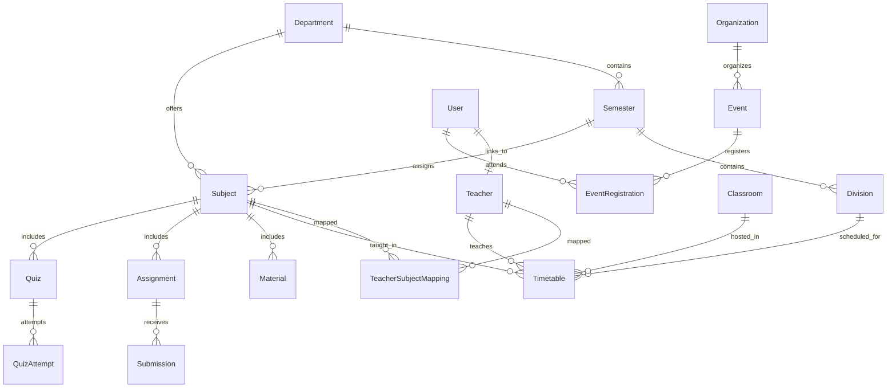

# 🎓 EduX Planner — Smart Timetable & Academic Management System

> **A Comprehensive, Role-Based Academic Scheduling and Campus Operations Platform featuring Constraint-Satisfying Timetable Generation, Multi-Role Portals, Cloud E-Learning with AI Quiz Generation, Campus Event Management with Test-Mode Payments, and Automated Email Notifications.**

---

[](https://nodejs.org/)
[](https://expressjs.com/)
[](https://react.dev/)
[](https://vite.dev/)
[](https://www.mongodb.com/)
[](https://tailwindcss.com/)
[](https://razorpay.com/)
[](https://ai.google.dev/)

---

## 📌 Table of Contents

- [Overview](#-overview)
- [Key Features](#-key-features)
- [System Architecture](#-system-architecture)
- [Technology Stack](#-technology-stack)
- [System Modules & Portals](#-system-modules--portals)
  - [1. Administrator Portal](#1-administrator-portal)
  - [2. Faculty / Teacher Portal](#2-faculty--teacher-portal)
  - [3. Student Portal](#3-student-portal)
  - [4. Intelligent Timetable Engine](#4-intelligent-timetable-engine)
  - [5. E-Learning & AI Quiz System](#5-e-learning--ai-quiz-system)
  - [6. Campus Events & Test-Mode Payments](#6-campus-events--test-mode-payments)
  - [7. Email & OTP Verification Flow](#7-email--otp-verification-flow)
  - [8. Analytics & Diagnostic Engine](#8-analytics--diagnostic-engine)
- [Database Design & Data Models](#-database-design--data-models)
- [REST API Reference](#-rest-api-reference)
- [Security & Authentication](#-security--authentication)
- [Project Directory Structure](#-project-directory-structure)
- [Installation & Getting Started](#-installation--getting-started)
- [Environment Variables](#-environment-variables)
- [Running the Application](#-running-the-application)
- [Development & Test Accounts](#-development--test-accounts)
- [Testing & Quality Assurance](#-testing--quality-assurance)
- [Project Status](#-project-status)
- [Future Roadmap](#-future-roadmap)
- [Contributing](#-contributing)
- [Author & Acknowledgments](#-author--acknowledgments)

---

## 📖 Overview

### The Problem
Academic institutions face complex scheduling challenges every semester. Coordinating faculty availability, room allocations, student division curricula, lab room equipment requirements, and unexpected teacher leaves requires balancing dozens of conflicting constraints. Traditional manual scheduling and static spreadsheets frequently cause:
- **Faculty & Room Collisions:** The same instructor or physical classroom is inadvertently scheduled across multiple divisions simultaneously.
- **Curriculum & Workload Discrepancies:** Teachers exceed contractual teaching hours while subjects fall short of required weekly periods.
- **Fragmented Campus Operations:** Timetables, study materials, student assignments, quizzes, and campus event registrations remain scattered across disconnected tools.

### The EduX Solution
**EduX Planner** is an integrated academic scheduling and campus operations platform built on the MERN stack (MongoDB, Express.js, React, Node.js). It combines a **deterministic multi-constraint scheduling engine** with **AI-assisted heuristic generation** (Google Gemini & DeepSeek), **dynamic workload calculation**, **digital classroom management**, **e-learning content with automated AI quiz generation**, and **event registrations with Razorpay test-mode payments**.

### Who Uses EduX Planner?
1. **Academic Administrators:** Configure departments, semesters, divisions, subjects, faculty workloads, and physical classrooms. Generate, refine, validate, and publish weekly timetables; manage faculty leaves; and organize campus events.
2. **Faculty / Teachers:** Access personal weekly schedules, apply for leaves, upload subject study materials, publish assignments, grade student submissions, and auto-generate interactive quizzes from document uploads (PDF/PPT/PPTX).
3. **Students:** Self-register with 6-digit email OTP verification, view division timetables, download learning materials, submit assignments, take timed interactive quizzes with instant score breakdowns, and register for campus workshops and hackathons with digital ticket delivery.

---

## 🌟 Key Features

### 🏛️ Core Academic Management
- **Hierarchical Academic Structure:** Department $\rightarrow$ Semester $\rightarrow$ Division relational scoping.
- **Subject Management:** Configure subject codes, theory vs. laboratory classification, weekly period quotas, credits, and assigned faculty mappings.
- **Teacher Profiles:** Track designations, departments, contact details, and contractual maximum teaching hours per week.
- **Classroom & Facility Management:** Maintain room inventories with types (Classroom, Laboratory, Computer Lab, Seminar Hall, Auditorium), floor numbers, buildings, seating capacities, and equipment tags (Projector, WiFi, Smart Board, AC, LAN).

### ⚡ Intelligent Timetable Builder
- **Universal Timetable Matrix:** 6 Days (Monday – Saturday) across 6 standard university class periods (09:30 – 16:20) and 2 system breaks.
- **Multi-Constraint Conflict Prevention:** Real-time prevention of teacher double-booking, room overlap, division collisions, and contractual workload violations.
- **AI-Powered Generation Modes:**
  - `Smart Fill Remaining`: Retains existing manual schedule entries and fills only vacant slots using constraint satisfaction heuristics.
  - `AI Full Rebuild`: Re-evaluates all subject curriculum quotas and constructs a complete, freshly optimized schedule.
  - `Regenerate Better`: Multi-candidate heuristic pass optimizing daily balance, subject spread, and pattern diversity.
- **Interactive Slot Operations:** Update lecture details, move periods with live collision checks, replace faculty with AI compatibility recommendations, and delete slots with workload impact analysis.
- **Public Shared Timetables:** Generate secure tokenized share links (`/shared/:token`) for public read-only timetable viewing.
- **Audit Log Trail:** Complete history tracking for planner actions (ADD, MOVE, REPLACE, DELETE, HOLIDAY) with timestamps and administrative user IDs.
- **Multi-Format Exporting:** Single-click exports to branded **PDF**, **Excel (.xlsx)**, and **CSV**.

### 📚 E-Learning & Assessment System
- **Study Materials Repository:** Upload and distribute lecture notes, syllabus files, and documents with secure signed Cloudinary URLs.
- **Assignment Management:** Create assignments with deadline enforcement, accept student file submissions, and provide grades and qualitative feedback.
- **AI Quiz Generator:** Upload PDF, PPT, or PPTX lecture slides to extract text and automatically generate structured multiple-choice quizzes (questions, options, correct answers, and explanations).
- **Single Question Regenerator:** Re-prompt AI to regenerate individual questions without discarding the entire quiz.
- **Student Quiz Experience:** Timed interactive quiz attempts with single-attempt enforcement, instant score calculation, percentage analytics, and question-by-question answer reviews with detailed explanations.

### 🎟️ Campus Events & Test-Mode Payments
- **Partner Organization Directory:** Manage campus sponsors, recruiters, and partner organizations with custom logos and contact info.
- **Targeted Event Management:** Create events with department and semester audience targeting, registration deadlines, and seat capacity limits.
- **Razorpay Test-Mode Checkout:** Seamless popup checkout for paid event registrations with client-side script loader and server-side HMAC-SHA256 signature verification.
- **Automated Digital Tickets:** Automated issuance of unique Ticket IDs and styled HTML email dispatch via Nodemailer upon successful registration.
- **Event Analytics & Exports:** Real-time registration statistics, revenue tracking, and one-click CSV export of attendee lists.

### 🔐 Security & Communication
- **Dual-Token JWT Authentication:** Short-lived access tokens and long-lived refresh tokens stored in secure, `HttpOnly`, `SameSite: Lax` cookies.
- **Role-Based Access Control (RBAC):** Strict middleware gating for `admin`, `teacher`, and `student` roles across API endpoints and React UI routes.
- **Email & OTP Services:** Nodemailer integration supporting 6-digit registration OTP verification, password reset links, event ticket delivery, and timetable modification alerts.

---

## 🏗️ System Architecture

```
                                  ┌─────────────────────────────────────────────────────────┐
                                  │                  CLIENT LAYER (SPA)                     │
                                  │   React 18  ·  Vite 8  ·  Tailwind CSS  ·  Framer Motion│
                                  └───────────┬─────────────────────────────────┬───────────┘
                                              │ Axios (withCredentials: true)   │
                                              ▼                                 ▼
                                  ┌─────────────────────────────────────────────────────────┐
                                  │                  API GATEWAY / SERVER                   │
                                  │       Node.js  ·  Express.js  ·  Helmet  ·  CORS        │
                                  │    Rate Limiters (API / Auth / Save / Generate)         │
                                  └─────┬──────────────┬──────────────┬──────────────┬──────┘
                                        │              │              │              │
                    ┌───────────────────┘              │              │              └───────────────────┐
                    ▼                                  ▼              ▼                                  ▼
      ┌───────────────────────────┐      ┌─────────────────┐    ┌─────────────────┐      ┌───────────────────────────┐
      │   AUTHENTICATION & RBAC   │      │ TIMETABLE ENGINE│    │   E-LEARNING    │      │      CAMPUS EVENTS        │
      │  JWT (HttpOnly Cookies)   │      │  Constraint     │    │  Material Hub   │      │  Partner Organizations    │
      │  Bcrypt Password Hash     │      │  Satisfaction   │    │  Assignments    │      │  Audience Filtering       │
      │  Role Middleware          │      │  Validation     │    │  Quiz Engine    │      │  Ticket Generation        │
      └─────────────┬─────────────┘      └────────┬────────┘    └────────┬────────┘      └─────────────┬─────────────┘
                    │                             │                      │                             │
                    └─────────────────────────────┼──────────────────────┼─────────────────────────────┘
                                                  ▼                      ▼
                                  ┌─────────────────────────────────────────────────────────┐
                                  │                 DATA PERSISTENCE LAYER                  │
                                  │            MongoDB (Mongoose ODM v8.0+)                 │
                                  │  Indexed Collections  ·  Dynamic Aggregation Pipelines  │
                                  └───────────┬─────────────────────────────────┬───────────┘
                                              │                                 │
                                              ▼                                 ▼
                                ┌───────────────────────────┐     ┌───────────────────────────┐
                                │   EXTERNAL INTEGRATIONS   │     │      AI & MEDIA SUITE     │
                                │  • Nodemailer (SMTP)      │     │  • Google Generative AI   │
                                │  • Razorpay (Test Mode)   │     │  • DeepSeek API (Quiz)    │
                                │  • Office/PDF Text Parser │     │  • Cloudinary (Storage)   │
                                └───────────────────────────┘     └───────────────────────────┘
```

---

## 💻 Technology Stack

| Layer | Technology | Version | Purpose & Usage in Project |
| :--- | :--- | :--- | :--- |
| **Frontend Framework** | React.js | `^18.2.0` | Component-based UI architecture with declarative hooks and state management |
| **Build Tooling** | Vite | `^8.0.12` | High-speed ESM bundler and local development server |
| **Styling** | Tailwind CSS | `^3.4.0` | Utility-first responsive CSS styling with custom theme palette |
| **Animations** | Framer Motion | `^12.40.0` | Page transitions, tab morphing, and modal dialog micro-animations |
| **Routing** | React Router DOM | `^6.20.1` | Declarative client-side routing with `ProtectedRoute` and `PublicRoute` wrappers |
| **Icons** | Lucide React | `^0.303.0` | Modern, consistent iconography across all portals |
| **Client Exports** | jsPDF / ExcelJS / html2canvas | Latest | In-browser generation of high-resolution PDF, CSV, and Excel timetables |
| **Backend Runtime** | Node.js | `v18+` | Asynchronous JavaScript runtime for server-side logic |
| **Web Framework** | Express.js | `^4.18.2` | RESTful API server, routing, custom error middleware, and body parsing |
| **Database & ODM** | MongoDB / Mongoose | `^8.0.3` | Document-oriented schema definitions, compound indexes, and aggregations |
| **Authentication** | JSON Web Tokens (JWT) | `^9.0.2` | Secure dual-token rotation stored in `HttpOnly` cookies |
| **Password Hashing** | bcryptjs | `^2.4.3` | Salted one-way password encryption (10 salt rounds) |
| **Security Middleware**| Helmet / CORS / Express-Rate-Limit | Latest | HTTP security headers, origin whitelisting, and rate-limiting against abuse |
| **AI Quiz & Schedulers**| Google Generative AI / DeepSeek | `^0.24.1` | Automated quiz generation and timetable diagnostic reasoning |
| **Document Parsers** | officeparser / pdf-parse | Latest | Text extraction from uploaded PDF, PPT, and PPTX files for AI quizzes |
| **Payment Gateway** | Razorpay SDK | `^2.9.8` | **Test-mode** order creation and cryptographic payment signature verification |
| **Email Service** | Nodemailer | `^6.10.1` | SMTP email dispatch for OTPs, ticket receipts, and schedule updates |
| **Media Storage** | Cloudinary / Multer | `^1.41.3` | Multipart file upload and cloud storage for event banners, logos, and materials |

---

## 🧩 System Modules & Portals

### 1. Administrator Portal
Accessible via `/dashboard` for users authenticated with the `admin` role.

- **Dashboard Overview:** Displays real-time counts for teachers, subjects, classrooms, schedule health score, and quick navigation cards.
- **Timetable Builder:** Interactive grid supporting manual period addition, drag-and-drop slot shifting, smart generation modes, holiday locking, and export utilities.
- **Teacher Management:** Full CRUD operations for faculty records, contractual weekly teaching hour limits, subject assignments, and Excel/CSV bulk import.
- **Subject Management:** Create and manage academic subjects, configure weekly period quotas, credits, department/semester mappings, and laboratory flags.
- **Classroom Management:** Manage classrooms with room numbers, buildings, floors, capacities, room types, facilities checklists, active timetable conflict warnings, and interactive room schedule modals.
- **Campus Events & Promotions:** Manage partner organizations, create and publish events with target audience filters (department/semester), monitor registrations, export attendee CSVs, and inspect revenue analytics.
- **Leave Management:** Review faculty leave applications, approve or reject requests with administrative remarks, and view automatic substitution records.
- **Analytics:** Consolidated metrics showing schedule completion percentage, faculty workload balance distributions, classroom utilization rates, and conflict counters.
- **Settings & Sample Data:** View system-wide weekly timing slot configurations and trigger sample academic demo data seeding.

---

### 2. Faculty / Teacher Portal
Accessible via `/teacher-timetable`, `/teacher-elearning`, `/teacher-leaves`, and `/teacher-profile` for authenticated `teacher` accounts.

- **My Timetable:** Personalized view of the teacher's scheduled weekly lectures and laboratory sessions with day/week toggle filters and PDF timetable download.
- **Leaves Management:** Submit leave requests with date ranges and reasons, track approval status (Pending, Approved, Rejected), and cancel pending applications.
- **My Content (E-Learning Hub):**
  - *Study Materials:* Upload PDF documents, notes, or reference links categorized by assigned subjects.
  - *Assignments:* Create assignments with due dates and attachments, view student submissions, download submitted files, and assign grades and feedback.
  - *AI Quiz Creation:* Upload PDF, PPT, or PPTX presentation slides; configure question count, difficulty, and question type; generate questions via AI; review and edit questions before publishing.
  - *Manual Quiz Creation:* Build custom quizzes with configurable time limits, marks per question, and custom explanations for correct answers.
  - *Quiz Attempt Logs:* View student attempt lists, scores, submission times, and percentages.
- **Faculty Profile:** View registered department, contact email, designation, and contractual workload allotment.

---

### 3. Student Portal
Accessible via `/student-dashboard` for authenticated `student` accounts.

- **Self-Registration & OTP Verification:** Public registration at `/register` with 6-digit email OTP verification via Nodemailer before account activation.
- **My Timetable:** View division-specific weekly schedule, room allocations, instructor names, and download schedule PDFs.
- **E-Learning Portal:**
  - *Study Materials:* Access and download subject learning materials using secure signed download URLs.
  - *Assignments:* View pending and completed assignments, submit solution files, and view instructor grades and feedback.
  - *Interactive Quizzes:* Attempt active subject quizzes with a live countdown timer. Single-attempt enforcement ensures test integrity.
  - *Instant Quiz Results:* Upon submission, students receive a score summary (Total Score, Marks, Percentage, Correct, Wrong, Unanswered) along with question-by-question reviews containing correct answers and explanations.
- **Campus Events & Workshops:**
  - *Explore Events:* Browse upcoming campus events tailored to the student's department and semester.
  - *Free Event Registration:* Instant one-click registration with confirmation receipts.
  - *Paid Event Registration (Test Mode):* Launch Razorpay checkout popup to complete test payments.
  - *Confirmed Digital Tickets:* Receive email tickets containing unique Ticket IDs, event details, venue info, and payment references.
  - *My Events Tab:* Access registered events and trigger email ticket re-sends.

---

### 4. Intelligent Timetable Engine

The core scheduling engine (`backend/services/schedulingEngine.js`) resolves academic schedules using a multi-candidate constraint satisfaction algorithm:

#### University Timing Configuration
| Slot Number | Timing | Period Type |
| :--- | :--- | :--- |
| **Period 1** | `09:30 - 10:25` | Standard Academic Lecture / Lab Part 1 |
| **Period 2** | `10:25 - 11:20` | Standard Academic Lecture / Lab Part 2 |
| *Break 1* | `11:20 - 12:20` | **Morning Recess (Locked / Non-Teachable)** |
| **Period 3** | `12:20 - 13:15` | Standard Academic Lecture / Lab Part 1 |
| **Period 4** | `13:15 - 14:10` | Standard Academic Lecture / Lab Part 2 |
| *Break 2* | `14:10 - 14:30` | **Afternoon Break (Locked / Non-Teachable)** |
| **Period 5** | `14:30 - 15:25` | Standard Academic Lecture / Lab Part 1 |
| **Period 6** | `15:25 - 16:20` | Standard Academic Lecture / Lab Part 2 |

#### Hard Constraints Enforced by the Validation Engine
1. **Teacher Conflict Prevention:** A faculty member cannot be scheduled for more than one class across all departments and divisions at the same time.
2. **Room Double-Booking Prevention:** A physical classroom or laboratory cannot host multiple divisions during the same time slot.
3. **Division Overlap Prevention:** A division cannot have multiple simultaneous theory lectures.
4. **Consecutive Laboratory Blocks:** 2-period lab sessions must occupy valid consecutive pairs (`09:30-11:20`, `12:20-14:10`, or `14:30-16:20`) without crossing break periods.
5. **Room Type Compatibility:** Laboratory subjects must be assigned to rooms tagged as `Laboratory` or `Computer Lab`.
6. **Faculty Workload Limits:** A teacher cannot be assigned more weekly periods than their configured `max_hours_per_week`.
7. **Curriculum Quota Enforcement:** Scheduled periods for a subject cannot exceed its required weekly periods.

---

### 5. E-Learning & AI Quiz System

```
  ┌─────────────────────────┐
  │  Teacher Uploads File   │  (.pdf, .ppt, .pptx study notes)
  └───────────┬─────────────┘
              ▼
  ┌─────────────────────────┐
  │ Text Extraction Service │  (officeparser / pdf-parse buffer extractor)
  └───────────┬─────────────┘
              ▼
  ┌─────────────────────────┐
  │  AI Quiz Generation     │  (Google Gemini / DeepSeek API)
  │  Structured Schema      │  Prompt: questions, options, correct index, explanation
  └───────────┬─────────────┘
              ▼
  ┌─────────────────────────┐
  │ Teacher Review & Edit   │  (Modify questions, regenerate single item, save)
  └───────────┬─────────────┘
              ▼
  ┌─────────────────────────┐
  │  Student Takes Quiz     │  (Timed interactive modal, single attempt check)
  └───────────┬─────────────┘
              ▼
  ┌─────────────────────────┐
  │ Instant Results & Score │  (Score, percentage, correct/wrong, question explanations)
  └─────────────────────────┘
```

---

### 6. Campus Events & Test-Mode Payments

> [!NOTE]
> **Razorpay Integration Status: TEST MODE**
> The current Razorpay implementation is configured for **sandbox/test-mode verification**. All payments use Razorpay test key IDs (`rzp_test_...`) and test payment credentials. Production payment processing is not enabled.

```
  ┌─────────────────────────┐
  │ Student Selects Event   │  (Filtered by Department & Semester)
  └───────────┬─────────────┘
              ▼
  ┌─────────────────────────┐
  │  POST /create-order     │  Backend calculates fee in paise & generates Razorpay Order
  └───────────┬─────────────┘
              ▼
  ┌─────────────────────────┐
  │ Razorpay Checkout Modal │  Client opens Razorpay standard test checkout popup
  └───────────┬─────────────┘
              ▼
  ┌─────────────────────────┐
  │  POST /verify-payment   │  Backend verifies HMAC-SHA256 signature (Order + Payment ID)
  └───────────┬─────────────┘
              ▼
  ┌─────────────────────────┐
  │ Confirmation & Ticket   │  Unique Ticket ID issued, status marked PAID & CONFIRMED
  └───────────┬─────────────┘
              ▼
  ┌─────────────────────────┐
  │  Nodemailer Email Dispatch │  Styled HTML confirmation ticket sent to student email
  └─────────────────────────┘
```

---

### 7. Email & OTP Verification Flow

All outgoing email dispatches are processed via Nodemailer with fallback console logging during local development:

1. **Student Registration OTP (`sendOtpEmail`):** Generates a 6-digit numeric OTP with a 10-minute expiry time. Users must verify the OTP to activate their account.
2. **Event Ticket Confirmation (`sendEventTicketEmail`):** Dispatches an official digital entry pass containing the student name, event title, date, time, venue, payment reference, and Ticket ID.
3. **Password Reset Token (`sendResetPasswordEmail`):** Dispatches a secure 1-hour expiration reset link (`/reset-password?token=...`).
4. **Timetable Update Notification (`sendTimetableUpdateEmail`):** Informs faculty when their weekly division assignment has been modified.

---

### 8. Analytics & Diagnostic Engine

Calculated dynamically in `backend/controllers/analyticsController.js` without relying on static counters:
- **Schedule Health Score:** Computed out of 100 based on conflict penalties, room availability, and completion rate.
- **Timetable Completion Rate:** Compares filled slots against the total required curriculum periods across active divisions.
- **Faculty Workload Balance:** Aggregates individual assigned teaching hours against contract capacities.
- **Scheduling Conflicts Count:** Quantifies teacher clashes, room double-bookings, and flagged collisions.
- **Free Rooms Count:** Identifies idle physical classrooms during scheduled periods.

---

## 🗄️ Database Design & Data Models

The system uses 20+ strictly typed Mongoose models:



### Key Models & Their Responsibilities
- **`User.js`**: Core identity (email, password hash, role: `admin` | `teacher` | `student`, OTP fields, verified status).
- **`Teacher.js`**: Faculty details (faculty name, department, designation, contact info, `max_hours_per_week`, assigned subjects).
- **`Subject.js`**: Curricular subjects (name, code, department, semester, `weekly_periods`, credits, type: `theory` | `lab`).
- **`Classroom.js`**: Physical facilities (room number, building, floor, room type, capacity, facilities array, status).
- **`Timetable.js`**: Scheduled periods (day, timeSlot, department, semester, division, subject, teacher, classroom, isLab, status).
- **`Department.js` / `Semester.js` / `Division.js`**: Core academic organizational units.
- **`TeacherLeave.js`**: Leave requests (startDate, endDate, reason, status: `pending` | `approved` | `rejected`, remarks).
- **`Material.js`**: E-learning study resources (title, subject, type, fileUrl, uploadedBy).
- **`Assignment.js` / `Submission.js`**: Homework tasks, student file attachments, grades, and teacher feedback.
- **`Quiz.js` / `QuizAttempt.js`**: Multiple-choice assessments (questions, options, correct answers, explanations, student answers, scores).
- **`Organization.js`**: Campus partner entities (name, description, logoUrl, website, email, phone).
- **`Event.js` / `EventRegistration.js`**: Campus events (title, date, fee, target department/semester, registrations, payment IDs, ticket IDs).
- **`Payment.js`**: Transaction logs (order ID, payment ID, amount, currency, status, gateway signature).
- **`AuditLog.js`**: Administrative planner action history trail.
- **`WeeklyConfig.js`**: Holiday configurations per academic division.

---

## 📡 REST API Reference

All backend routes are prefixed with `/api`.

### 1. Authentication (`/api/auth`)
| Method | Endpoint | Description | Auth Required |
| :--- | :--- | :--- | :--- |
| `POST` | `/api/auth/register` | Register a new user account | Public |
| `POST` | `/api/auth/send-otp` | Generate and dispatch 6-digit email OTP | Public |
| `POST` | `/api/auth/verify-otp` | Verify email OTP and activate account | Public |
| `POST` | `/api/auth/login` | Authenticate user and issue JWT cookies | Public |
| `POST` | `/api/auth/demo/teacher`| One-click demo login for faculty | Public (Dev Only) |
| `POST` | `/api/auth/refresh` | Rotate access token using refresh cookie | Public |
| `POST` | `/api/auth/logout` | Clear authentication cookies | Authenticated |
| `GET` | `/api/auth/me` | Fetch authenticated user profile | Authenticated |
| `PUT` | `/api/auth/profile` | Update user profile information | Authenticated |
| `PUT` | `/api/auth/change-password` | Change account password | Authenticated |
| `POST` | `/api/auth/forgot-password` | Request password reset token | Public |
| `POST` | `/api/auth/reset-password` | Reset password using email token | Public |

### 2. Timetable Management (`/api/timetable`)
| Method | Endpoint | Description | Auth Required |
| :--- | :--- | :--- | :--- |
| `GET` | `/api/timetable/shared/:token` | View public shared timetable | Public |
| `GET` | `/api/timetable/student/me` | Fetch authenticated student's timetable | Student |
| `GET` | `/api/timetable/division/:id` | Fetch timetable for specific division | Authenticated |
| `GET` | `/api/timetable/teacher/:id` | Fetch timetable for specific teacher | Authenticated |
| `POST` | `/api/timetable/generate` | Save generated timetable to database | Admin |
| `POST` | `/api/timetable/draft` | Save schedule draft | Admin |
| `POST` | `/api/timetable/auto-generate` | Run auto-generation engine | Admin |
| `POST` | `/api/timetable/smart-generate`| Run smart constraint generator | Admin |
| `PATCH`| `/api/timetable/move` | Move/shift scheduled slot | Admin |
| `POST` | `/api/timetable/copy` | Copy timetable across divisions | Admin |
| `PATCH`| `/api/timetable/update-teacher`| Update assigned teacher in slot | Admin |
| `POST` | `/api/timetable/set-holiday` | Set or remove division holiday | Admin |
| `DELETE`| `/api/timetable/reset` | Clear all slots for a division | Admin |
| `POST` | `/api/timetable/validate-change`| Pre-flight check for slot modifications | Admin |
| `POST` | `/api/timetable/replacement-eligibility` | Find eligible substitute faculty | Admin |
| `POST` | `/api/timetable/move-check` | Check collision safety before slot move | Admin |
| `POST` | `/api/timetable/suggest-fix` | Get AI suggestions to fix slot clashes | Admin |
| `GET` | `/api/timetable/audit-logs` | Fetch admin planner action logs | Admin |
| `POST` | `/api/timetable/share` | Generate public share link token | Admin |

### 3. Classroom Management (`/api/classrooms`)
| Method | Endpoint | Description | Auth Required |
| :--- | :--- | :--- | :--- |
| `GET` | `/api/classrooms` | List all classrooms with filters | Authenticated |
| `POST` | `/api/classrooms` | Create a new classroom | Admin |
| `GET` | `/api/classrooms/stats` | Get classroom inventory statistics | Authenticated |
| `GET` | `/api/classrooms/available` | Get classrooms available at a specific slot | Authenticated |
| `GET` | `/api/classrooms/:id` | Get classroom details by ID | Authenticated |
| `GET` | `/api/classrooms/:id/schedule` | Get weekly occupancy grid for a room | Authenticated |
| `PUT` | `/api/classrooms/:id` | Update classroom details | Admin |
| `DELETE`| `/api/classrooms/:id` | Delete classroom (prevents active clash) | Admin |

### 4. E-Learning & AI Quizzes (`/api/elearning`)
| Method | Endpoint | Description | Auth Required |
| :--- | :--- | :--- | :--- |
| `GET` | `/api/elearning/teacher-subjects` | List subjects assigned to teacher | Teacher / Admin |
| `GET` | `/api/elearning/material` | List study materials | Authenticated |
| `POST` | `/api/elearning/material` | Upload new study material | Teacher / Admin |
| `DELETE`| `/api/elearning/material/:id` | Delete study material | Teacher / Admin |
| `GET` | `/api/elearning/assignment` | List assignments | Authenticated |
| `POST` | `/api/elearning/assignment` | Create an assignment | Teacher / Admin |
| `DELETE`| `/api/elearning/assignment/:id` | Delete an assignment | Teacher / Admin |
| `GET` | `/api/elearning/assignment/:id/submissions` | View student assignment submissions | Teacher / Admin |
| `POST` | `/api/elearning/assignment/:id/submit` | Submit solution file for assignment | Student |
| `PUT` | `/api/elearning/submission/:id/grade` | Grade student submission | Teacher / Admin |
| `POST` | `/api/elearning/quiz/generate-ai` | Generate quiz from PDF/PPT buffer | Teacher / Admin |
| `POST` | `/api/elearning/quiz/regenerate-question` | Regenerate single quiz question | Teacher / Admin |
| `GET` | `/api/elearning/quiz` | List quizzes | Authenticated |
| `GET` | `/api/elearning/quiz/:id` | Get quiz details | Authenticated |
| `POST` | `/api/elearning/quiz` | Manually create a quiz | Teacher / Admin |
| `PUT` | `/api/elearning/quiz/:id` | Update existing quiz | Teacher / Admin |
| `DELETE`| `/api/elearning/quiz/:id` | Delete a quiz | Teacher / Admin |
| `GET` | `/api/elearning/quiz/:id/attempts` | View student attempts for a quiz | Teacher / Admin |
| `POST` | `/api/elearning/quiz/:id/submit` | Submit quiz attempt and get scores | Student |
| `GET` | `/api/elearning/quiz/:id/result` | Fetch completed quiz result review | Student |

### 5. Campus Events & Test Payments (`/api/events`)
| Method | Endpoint | Description | Auth Required |
| :--- | :--- | :--- | :--- |
| `GET` | `/api/events/student/upcoming` | List upcoming events for student | Student |
| `GET` | `/api/events/student/my-events` | List events registered by student | Student |
| `POST` | `/api/events/:id/register` | Register for a free event | Student |
| `POST` | `/api/events/:id/create-order` | Create Razorpay order (Test Mode) | Student |
| `POST` | `/api/events/:id/verify-payment` | Verify Razorpay payment signature | Student |
| `POST` | `/api/events/:id/registrations/:registrationId/resend-email` | Resend digital ticket email | Student |
| `GET` | `/api/events/admin` | List all campus events | Admin |
| `GET` | `/api/events/admin/stats` | Get event registration & revenue metrics | Admin |
| `POST` | `/api/events` | Create new campus event | Admin |
| `PUT` | `/api/events/:id` | Update campus event details | Admin |
| `DELETE`| `/api/events/:id` | Delete campus event | Admin |
| `POST` | `/api/events/:id/publish` | Publish event to students | Admin |
| `POST` | `/api/events/:id/unpublish` | Unpublish event to draft | Admin |
| `POST` | `/api/events/:id/cancel` | Cancel event | Admin |
| `GET` | `/api/events/:id/registrations` | View attendee registration list | Admin |
| `GET` | `/api/events/:id/export` | Export attendee list as CSV | Admin |
| `GET` | `/api/events/:id/analytics` | View event attendance & revenue stats | Admin |

### 6. Partner Organizations (`/api/organizations`)
| Method | Endpoint | Description | Auth Required |
| :--- | :--- | :--- | :--- |
| `GET` | `/api/organizations` | List all partner organizations | Authenticated |
| `POST` | `/api/organizations` | Create partner organization | Admin |
| `PUT` | `/api/organizations/:id` | Update organization details | Admin |
| `DELETE`| `/api/organizations/:id` | Delete partner organization | Admin |

### 7. Leaves & Substitutions (`/api/leaves` & `/api/teacher-portal`)
| Method | Endpoint | Description | Auth Required |
| :--- | :--- | :--- | :--- |
| `GET` | `/api/leaves` | List all teacher leave requests | Admin |
| `PUT` | `/api/leaves/:id/review` | Approve or reject a leave request | Admin |
| `GET` | `/api/teacher-portal/timetable` | Fetch teacher's weekly schedule | Teacher |
| `GET` | `/api/teacher-portal/leaves` | Fetch teacher's own leave history | Teacher |
| `POST` | `/api/teacher-portal/leaves` | Submit new leave application | Teacher |
| `DELETE`| `/api/teacher-portal/leaves/:id` | Cancel pending leave application | Teacher |
| `GET` | `/api/teacher-portal/profile` | Fetch teacher's profile details | Teacher |
| `GET` | `/api/teacher-portal/notifications` | Fetch teacher's system notifications | Teacher |

### 8. Analytics (`/api/analytics`)
| Method | Endpoint | Description | Auth Required |
| :--- | :--- | :--- | :--- |
| `GET` | `/api/analytics` | Compute schedule completion, conflicts & workload | Admin |

---

## 🔒 Security & Authentication

- **Cookie-Based JWT Rotation:** Tokens are delivered through secure, `HttpOnly`, `SameSite: Lax` cookies, protecting against Cross-Site Scripting (XSS) token theft.
- **Cryptographic Signatures:** Razorpay test-mode payment verifications compute SHA-256 HMAC digests using `crypto.timingSafeEqual` to prevent timing attacks.
- **Granular Rate Limiting:**
  - `apiLimiter`: 100 requests per 15 minutes for general API endpoints.
  - `loginLimiter`: 5 login attempts per 15 minutes to block brute-force attacks.
  - `authLimiter`: 10 OTP / registration requests per hour.
  - `saveLimiter`: 30 timetable save operations per minute.
  - `generateLimiter`: 5 AI timetable generation requests per minute.
- **Security Headers:** `helmet()` integration applies secure HTTP headers across all responses.
- **CORS Policies:** Configured with origin whitelisting and credential support for authorized frontend clients.

---

## 📁 Project Directory Structure

```
EduX_Time_Table_Managment-main/
├── backend/
│   ├── config/
│   │   ├── cloudinary.js          # Cloudinary media storage & Multer configuration
│   │   ├── db.js                  # MongoDB Mongoose connection pooler
│   │   └── env.js                 # Runtime environment validation
│   ├── controllers/
│   │   ├── adminDashboardController.js
│   │   ├── aiController.js        # AI Copilot diagnostics and substitution reasoning
│   │   ├── analyticsController.js # Dynamic workload and health score calculations
│   │   ├── authController.js      # User registration, OTP, JWT cookie authentication
│   │   ├── classroomController.js # Classroom CRUD, inventory, and schedule inspector
│   │   ├── eventController.js     # Event CRUD, publishing, and analytics
│   │   ├── eventRegistrationController.js # Registration, Razorpay checkout, tickets
│   │   ├── organizationController.js
│   │   ├── paymentWebhookController.js
│   │   ├── subjectController.js
│   │   ├── teacherController.js
│   │   ├── teacherLeaveController.js
│   │   ├── teacherPortalController.js
│   │   └── timetableController.js # Core planner, moves, slots, holidays, exports
│   ├── middleware/
│   │   ├── authMiddleware.js      # JWT extraction, user resolution, admin check
│   │   ├── elearningMiddleware.js # Teacher subject ownership validation
│   │   ├── errorHandler.js        # Centralized error handler
│   │   ├── rateLimiter.js         # Express-rate-limit instances
│   │   └── roleMiddleware.js      # Strict role-based route guard
│   ├── models/                    # 20+ Mongoose Data Models
│   │   ├── Classroom.js
│   │   ├── Event.js
│   │   ├── EventRegistration.js
│   │   ├── Material.js
│   │   ├── Organization.js
│   │   ├── Payment.js
│   │   ├── Quiz.js
│   │   ├── QuizAttempt.js
│   │   ├── Subject.js
│   │   ├── Teacher.js
│   │   ├── TeacherLeave.js
│   │   ├── Timetable.js
│   │   └── User.js
│   ├── routes/                    # Express REST route definitions
│   │   ├── authRoutes.js
│   │   ├── classroomRoutes.js
│   │   ├── elearningRoutes.js
│   │   ├── eventRoutes.js
│   │   ├── organizationRoutes.js
│   │   ├── teacherPortalRoutes.js
│   │   └── timetableRoutes.js
│   ├── scripts/                   # Seeding, repair, and database migration scripts
│   ├── services/
│   │   ├── aiQuizService.js       # Office/PDF text extractor and LLM quiz generator
│   │   ├── classroomService.js
│   │   ├── emailService.js        # Nodemailer OTP, ticket, and reset password emails
│   │   ├── razorpayService.js     # Razorpay order generation & HMAC signature verify
│   │   ├── schedulingEngine.js    # Deterministic multi-candidate constraint scheduler
│   │   └── validationEngine.js    # Real-time timetable conflict validator
│   ├── tests/                     # Node.js native test suite
│   └── server.js                  # Express application entry point
│
├── frontend/
│   ├── src/
│   │   ├── components/
│   │   │   ├── ClassroomManagement.jsx
│   │   │   ├── DashboardOverview.jsx
│   │   │   ├── Elearning/
│   │   │   │   ├── StudentElearning.jsx
│   │   │   │   └── TeacherContent.jsx
│   │   │   ├── Events/
│   │   │   │   ├── AdminEventManagement.jsx
│   │   │   │   ├── EventAnalyticsModal.jsx
│   │   │   │   ├── EventFormModal.jsx
│   │   │   │   ├── EventRegistrationsModal.jsx
│   │   │   │   ├── OrganizationModal.jsx
│   │   │   │   ├── StudentEventDetailModal.jsx
│   │   │   │   └── StudentEvents.jsx
│   │   │   ├── SmartGenerateModal.jsx
│   │   │   ├── StudentTimetablePreview.jsx
│   │   │   ├── SubjectManagement.jsx
│   │   │   ├── TeacherLeaveManagement.jsx
│   │   │   ├── TeacherManagement.jsx
│   │   │   ├── TimetableBuilder.jsx # Master interactive weekly timetable builder
│   │   │   └── ui/                  # Reusable UI component library (Button, Card, etc.)
│   │   ├── context/
│   │   │   ├── AuthContext.jsx      # Global authentication state
│   │   │   └── TimetableContext.jsx # Global timetable builder state
│   │   ├── pages/
│   │   │   ├── Analytics.jsx
│   │   │   ├── Dashboard.jsx        # Admin console with tabbed view
│   │   │   ├── ForgotPassword.jsx
│   │   │   ├── Home.jsx             # Role-aware landing / redirect page
│   │   │   ├── Import.jsx
│   │   │   ├── Login.jsx
│   │   │   ├── Register.jsx         # Student registration with OTP modal
│   │   │   ├── ResetPassword.jsx
│   │   │   ├── SharedTimetable.jsx  # Public read-only timetable view
│   │   │   ├── StudentDashboard.jsx # Student portal (Timetable, E-Learning, Events)
│   │   │   └── TeacherDashboard.jsx # Teacher portal (Timetable, Leaves, Content)
│   │   ├── routes/
│   │   │   └── ProtectedRoute.jsx   # Role-based route redirection guards
│   │   ├── services/
│   │   │   └── api.js               # Axios instance with auto-refresh interceptors
│   │   └── utils/                   # PDF, Excel, CSV export & Razorpay helpers
│   ├── package.json
│   └── vite.config.js
│
├── package.json                   # Root package configuration with helper scripts
└── README.md                      # Complete project documentation
```

---

## 🚀 Installation & Getting Started

### Prerequisites
- **Node.js**: `v18.0.0` or higher ([Download](https://nodejs.org/))
- **MongoDB**: Local MongoDB instance (`mongodb://127.0.0.1:27017`) or [MongoDB Atlas](https://www.mongodb.com/cloud/atlas) connection URI
- **npm**: `v9.0.0` or higher

### Step 1: Clone the Repository
```bash
git clone https://github.com/your-username/EduX_Time_Table_Managment.git
cd EduX_Time_Table_Managment-main
```

### Step 2: Install All Dependencies
Install backend dependencies and frontend dependencies in a single command:
```bash
npm run install-all
```
*Alternatively, install each manually:*
```bash
npm install
cd frontend && npm install && cd ..
```

---

## ⚙️ Environment Variables

Create a `.env` file in the root directory (using `.env.example` as a reference):

```env
# ── Server Configuration ──
NODE_ENV=development
PORT=8000
FRONTEND_URL=http://localhost:5173

# ── Database ──
MONGO_URI=mongodb://127.0.0.1:27017/timetable-scheduler

# ── JWT Authentication ──
JWT_SECRET=your_super_secret_jwt_key_minimum_32_characters_long
JWT_REFRESH_SECRET=your_super_secret_jwt_refresh_key_minimum_32_characters_long

# ── AI Services (Gemini / DeepSeek) ──
GEMINI_API_KEY=your_google_gemini_api_key
DEEPSEEK_API_KEY=your_deepseek_api_key_optional

# ── Razorpay Payment Gateway (Test Mode) ──
RAZORPAY_KEY_ID=rzp_test_your_test_key_id
RAZORPAY_KEY_SECRET=your_test_key_secret
RAZORPAY_WEBHOOK_SECRET=your_test_webhook_secret_optional

# ── Nodemailer SMTP (Email & OTP) ──
SMTP_HOST=smtp.gmail.com
SMTP_PORT=465
SMTP_USER=your_institution_email@gmail.com
SMTP_PASS=your_gmail_app_password
MAIL_FROM="EduX Planner" <no-reply@edux.edu>

# ── Cloudinary Media Storage ──
CLOUDINARY_CLOUD_NAME=your_cloudinary_cloud_name
CLOUDINARY_API_KEY=your_cloudinary_api_key
CLOUDINARY_API_SECRET=your_cloudinary_api_secret

# ── Demo / Testing Flags ──
ENABLE_DEMO_LOGIN=true
DEMO_ADMIN_EMAIL=admin@edux.com
DEMO_ADMIN_PASSWORD=Admin@123
DEMO_STUDENT_EMAIL=student@edux.com
DEMO_STUDENT_PASSWORD=Student@123
```

---

## 🏃 Running the Application

### 1. Seed Academic Demo Data (Optional but Recommended)
Populate the database with sample departments, semesters, divisions, subjects, faculty profiles, and classrooms:
```bash
npm run seed:demo
```

### 2. Start Both Backend and Frontend Concurrently
```bash
npm run dev
```
- **Backend API:** `http://localhost:8000`
- **Frontend SPA:** `http://localhost:5173`

### 3. Individual Service Commands
If you prefer running services in separate terminal sessions:

**Terminal 1 (Backend Server):**
```bash
npm run server
```

**Terminal 2 (Frontend Client):**
```bash
npm run client
```

---

## 👥 Development & Test Accounts

> [!IMPORTANT]
> **Development / Test Credentials Only**
> The following pre-configured demo credentials are for local development and testing:

| Role | Email | Password | Access Portal |
| :--- | :--- | :--- | :--- |
| **Administrator** | `admin@edux.com` | `Admin@123` | `/dashboard` (Full admin console) |
| **Faculty / Teacher**| `teacher1@edux.com` | `Teacher@123` | `/teacher-timetable` (Faculty portal) |
| **Student** | `student@edux.com` | `Student@123` | `/student-dashboard` (Student portal) |

*Note: New students can also self-register at `/register` and verify their account using email OTP (the OTP is logged to the backend console if SMTP is not configured).*

---

## 🧪 Testing & Quality Assurance

Run the automated backend test suite using Node.js native test runner:
```bash
npm test
```

### What the Test Suite Covers:
- **Classroom Management:** CRUD operations, duplicate room number prevention, availability queries, occupancy calculation, and timetable deletion protection.
- **Event Consistency:** Event creation, publish/unpublish state transitions, registration capacity checks, and revenue calculation.
- **Razorpay Signature Verification:** Test payment signature validation and webhook integrity.
- **Authentication & RBAC:** JWT cookie generation, password verification, and role restriction enforcement.

---

## 📊 Project Status

| Module / Feature | Implementation Status | Notes |
| :--- | :---: | :--- |
| **User Authentication & RBAC** | ✅ Implemented | Admin, Teacher, Student roles with dual JWT cookies |
| **Student Registration with Email OTP** | ✅ Implemented | 6-digit OTP dispatch via Nodemailer |
| **Timetable Builder (Manual Grid)** | ✅ Implemented | Visual grid, slot edit, move, replace, holiday lock |
| **AI Timetable Generator** | ✅ Implemented | Smart Fill Remaining, AI Full Rebuild, Regenerate Better |
| **Classroom Management** | ✅ Implemented | Inventory, capacities, facilities, schedule inspector |
| **Teacher & Subject Management** | ✅ Implemented | CRUD, workload limits, bulk Excel/CSV import |
| **Faculty Leave Management** | ✅ Implemented | Application, admin review, automatic substitution check |
| **E-Learning Hub** | ✅ Implemented | Materials upload, assignments with student submissions & grading |
| **AI Quiz Generator** | ✅ Implemented | File parsing (PDF/PPT/PPTX), question regeneration, attempts & review |
| **Campus Events & Workshops** | ✅ Implemented | Targeted events, registrations, attendee CSV exports, analytics |
| **Razorpay Payments** | ⚠️ Test Mode | Configured for Razorpay sandbox / test mode |
| **Multi-Format Exports** | ✅ Implemented | PDF, Excel (.xlsx), and CSV timetable exports |
| **Public Timetable Sharing** | ✅ Implemented | Secure tokenized links (`/shared/:token`) |

---

## 🗺️ Future Roadmap

- [ ] **Production Payment Gateway:** Upgrade Razorpay integration from sandbox to live production mode.
- [ ] **Attendance Integration:** Allow faculty to mark lecture attendance directly against scheduled timetable slots.
- [ ] **Push & In-App Notifications:** Real-time WebSockets integration for instant timetable modification alerts.
- [ ] **Mobile Application:** React Native mobile companion app for students and faculty.
- [ ] **Multi-Campus Multi-Tenant Support:** Support for multi-branch institutions with isolated department hierarchies.

---

## 🤝 Contributing

Contributions are welcome! To contribute:

1. **Fork** the repository.
2. **Create a Feature Branch**:
   ```bash
   git checkout -b feature/YourFeatureName
   ```
3. **Commit your Changes**:
   ```bash
   git commit -m "feat: Add YourFeatureName"
   ```
4. **Push to the Branch**:
   ```bash
   git push origin feature/YourFeatureName
   ```
5. **Open a Pull Request**.

---

## 👨‍💻 Author & Acknowledgments

**Tirth Oza**
- **Degree:** B.Tech in Information Technology, Parul University (Graduating 2027)
- **Email:** [ozatirth51@gmail.com](mailto:ozatirth51@gmail.com)
- **LinkedIn:** [linkedin.com/in/tirth-oza](https://linkedin.com/in/tirth-oza)
- **GitHub:** [github.com/ozatirth51](https://github.com/ozatirth51)

*EduX Planner — Transforming Academic Operations through Intelligent Scheduling & Unified Campus Management.*
